<center>

## 生成AIを副操縦士としたPythonプログラミングの超入門 <!-- omit in toc -->

### 新潟市立高志中等教育学校　 <!-- omit in toc -->
#### 2025/2/15(土)  9:30 - 10:45, 11:00  <!-- omit in toc -->
#### 講師：　開志専門職大学　情報学部　堀川 桂太郎 <!-- omit in toc -->
</center>

----
- [準備体操](#準備体操)
- [準備体操がすでに難しい場合](#準備体操がすでに難しい場合)
- [図形を描く](#図形を描く)
- [2Dから3D図形へ](#2dから3d図形へ)
- [銀河系を描く](#銀河系を描く)
- [レトロゲーム：ブレイクアウト、ブロック崩し](#レトロゲームブレイクアウトブロック崩し)
- [レトロゲーム：　シューティング](#レトロゲームシューティング)
- [生成AIとの関係、立ち位置](#生成aiとの関係立ち位置)
- [向いている? 向いていない? これからどうする？](#向いている-向いていない-これからどうする)
- [何度失敗しても、再チャレンジできる世界](#何度失敗しても再チャレンジできる世界)

### 概要：<!-- omit in toc -->

- 従来のプログラミング入門とは一線を画した全く新しい、
- 挫折しないプログラミング入門の導入編
- PokeLLMONの実況ナレーションの紹介から、生成AIの実力、世界観を知ってもらう
- 自分達の仕事・生活に及ぼすインパクトを感じてもらう


<div style="page-break-before: always;"></div>

----

### 本日のお品書き：メニュー  <!-- omit in toc -->

1. プログラミング：　楽しむ、ご利益
2. さっそくやってみよう
3. 図形を描く
4. 2Dを3Dへ
5. 銀河系を描く
6. シューティングゲーム？
7. 生成AIとの関係、立ち位置
8. 向いている? 向いていない? これからどうする？

----
### 準備体操

- Webブラウザ（Chrome,Safari, Edge,Firefox ・‥）を起動
- Googleアカウントでログイン:　URL： https://www.google.co.jp/


- 本ファイルの電子情報にアクセス：　https://github.com/keythrive/KSCES/

- Colaboratoryに入る: URL: https://colab.research.google.com/
- 「ノートブックを新規作成」

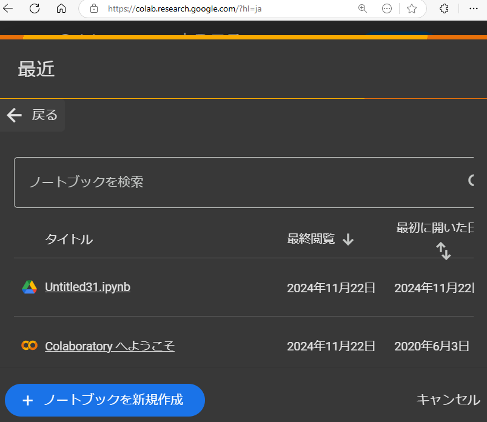
- 「+ コード」をクリックしてコードの入力状態へ
- 🔷Gemini：「利用可能なAI機能」をつかってコード生成を試す：「コードを生成する」
- 「日本語の文字列を読み上げる発話コードをPythonで作ってください。」

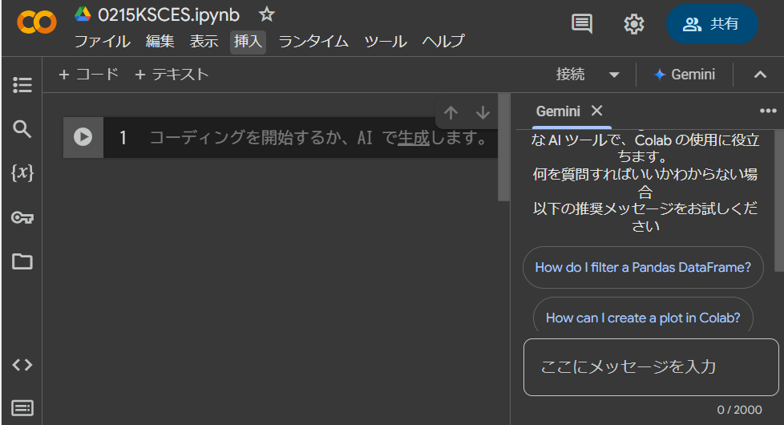

```python
# prompt: 日本語の文字列を読み上げる発話コードをPythonで作ってください。
!pip install gTTS

from gtts import gTTS
from IPython.display import Audio

def speak_japanese(text):
  tts = gTTS(text=text, lang='ja')
  tts.save("speech.mp3")
  return Audio("speech.mp3", autoplay=True)

# Example usage
speak_japanese("憧れてしまったら超えられない")

```
- 実行ボタン（▼）をクリックして動作確認する


<div style="page-break-before: always;"></div>

---
### 準備体操がすでに難しい場合

- ファイルのダウンロード： 0215Koushi.ipynb

   https://github.com/keythrive/KSCES/blob/main/0215Koushi.ipynb
  
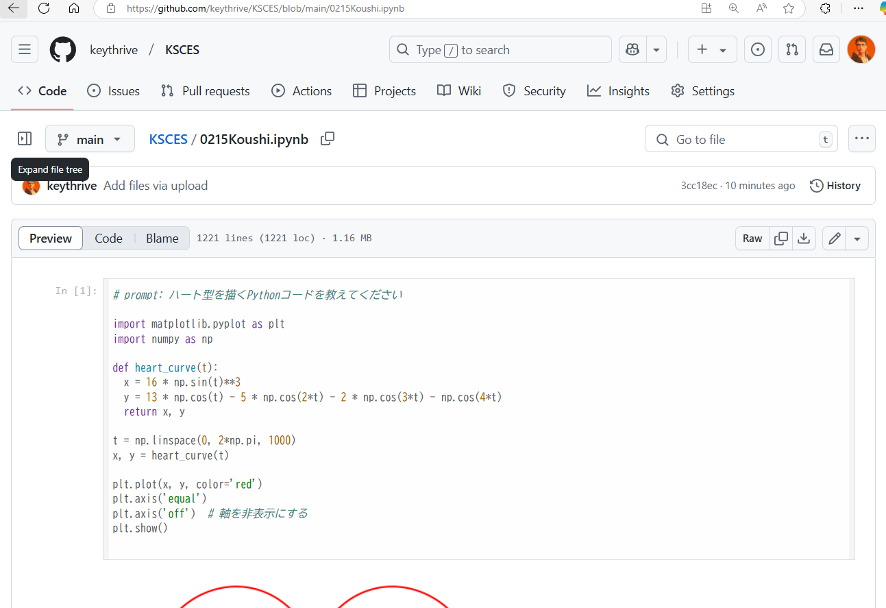

- 途中、どうしても難しい場合は、ダウンロードしたファイルをColaboratoryにアップロードできる

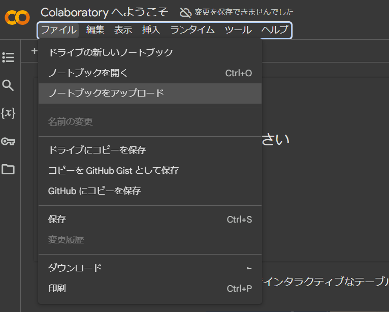


<div style="page-break-before: always;"></div>

----

### 図形を描く

- お題：　ハート型の曲線を描いてみる
- 条件：　一行もコードを書かない
- 生成AIへのお願いメッセージ（プロンプト）を考えてみよう

```
 ハート型を描くPythonコードを教えてください
```

- 生成AIの回答例（時と場合によって変ります）

```python
# prompt: ハート型を描くPythonコードを教えてください
import matplotlib.pyplot as plt
import numpy as np

def heart_curve(t):
  x = 16 * np.sin(t)**3
  y = 13 * np.cos(t) - 5 * np.cos(2*t) - 2 * np.cos(3*t) - np.cos(4*t)
  return x, y

t = np.linspace(0, 2*np.pi, 1000)
x, y = heart_curve(t)

plt.plot(x, y, color='red')
plt.axis('equal')
plt.axis('off')  # 軸を非表示にする
plt.show()

```


```
 線の太さを太くして、色をピンクで塗りつぶしてください
```

- 生成AIの回答例（時と場合によって変ります）

```python
# prompt: 線の太さを太くして、色をピンクで塗りつぶしてください

import matplotlib.pyplot as plt
import numpy as np


def heart_curve(t):
  x = 16 * np.sin(t)**3
  y = 13 * np.cos(t) - 5 * np.cos(2*t) - 2 * np.cos(3*t) - np.cos(4*t)
  return x, y

t = np.linspace(0, 2*np.pi, 1000)
x, y = heart_curve(t)

plt.plot(x, y, color='red', linewidth=5) # Linewidth increased and color changed to pink
plt.fill(x, y, color='pink') # Filled with pink color
plt.axis('equal')
plt.axis('off')  # 軸を非表示にする
plt.show()

```
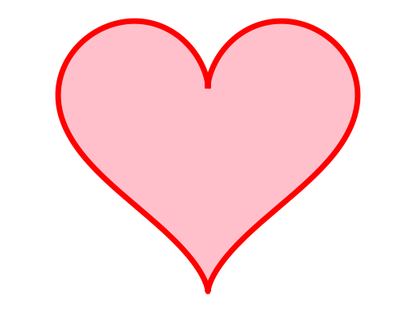


```
トランプのスペード型とクラブとダイヤの曲線を描いてください
```

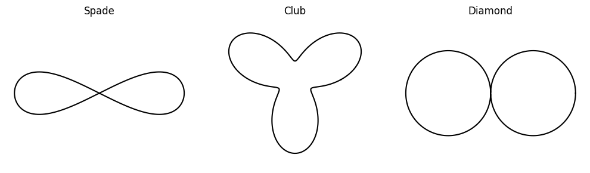

----
<div style="page-break-before: always;"></div>


### 2Dから3D図形へ

- お題：　ハートを3次元で表現する
- 条件：　一行もコードを書かない
- 生成AIへのお願いメッセージ（プロンプト）を考えてみよう
- 
```
 ハート曲線を3次元表示してください。
 plotlyを使って視点を移動できるようにしてください。
 ハートを7段重ねて表示してください。
 ハート曲線の色は、虹のように七色にしてください。

```

- 生成AIの回答例（時と場合によって変ります）

```python
# prompt:  ハート曲線を3次元表示してください。
#  plotlyを使って視点を移動できるようにしてください。
#  ハートを7段重ねて表示してください。
#  ハート曲線の色は、虹のように七色にしてください。

import plotly.graph_objects as go
import numpy as np

def heart_curve(t):
  x = 16 * np.sin(t)**3
  y = 13 * np.cos(t) - 5 * np.cos(2*t) - 2 * np.cos(3*t) - np.cos(4*t)
  return x, y

colors = ['red', 'orange', 'yellow', 'green', 'blue', 'indigo', 'violet']
fig = go.Figure()

for i in range(7):
    t = np.linspace(0, 2*np.pi, 1000)
    x, y = heart_curve(t)
    z = np.full_like(x, i) # z座標は段数に対応

    fig.add_trace(go.Scatter3d(x=x, y=y, z=z, mode='lines',
                              line=dict(width=10, color=colors[i % len(colors)])))

fig.update_layout(scene=dict(
                    xaxis_visible=False,
                    yaxis_visible=False,
                    zaxis_visible=False,
                    aspectmode='data'
                ),
                title='3D Heart Curve',
                showlegend=False)

fig.show()

```

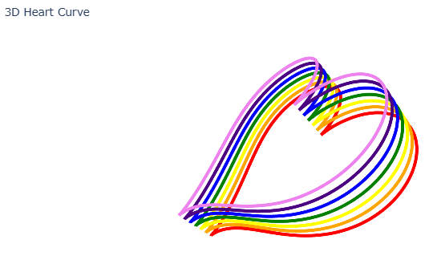

```python
import numpy as np
import matplotlib.pyplot as plt
from mpl_toolkits.mplot3d import Axes3D

# 媒介変数 t の範囲設定
t = np.linspace(0, 2 * np.pi, 1000)

# ハート曲線の方程式
x = 16 * np.sin(t)**3
y = 13 * np.cos(t) - 5 * np.cos(2 * t) - 2 * np.cos(3 * t) - np.cos(4 * t)
y *= -1

# 3Dプロット空間
fig = plt.figure(figsize=(7, 7))  # 図形のサイズ調整
ax = fig.add_subplot(111, projection='3d')

# 7色 (レインボーカラー)
colors = ['red', 'orange', 'yellow', 'green', 'blue', 'indigo', 'violet']

# ハート曲線を7回重ねる
for i, color in enumerate(colors):
    z = np.full_like(t, i)  # z軸方向にそれぞれの層を配置
    ax.plot(x, y, z, color=color, linewidth=8, label=f'Layer {i+1}')

# グラフの装飾
ax.set_title("3D Heart Curve with 7 Layers", fontsize=16)
ax.set_xlabel("X-axis")
ax.set_ylabel("Y-axis")
ax.set_zlabel("Z-axis")
ax.legend(loc='upper right')
ax.grid(False)

ax.view_init(elev=40, azim=55)

plt.show()
```

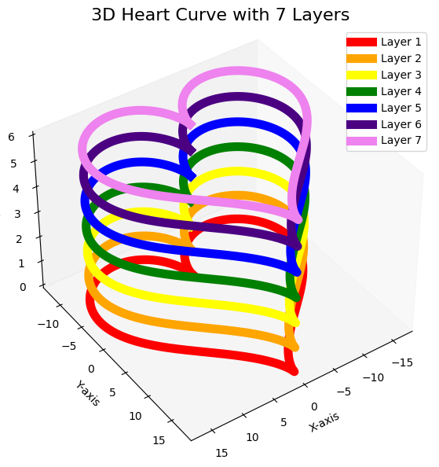


----

<div style="page-break-before: always;"></div>


###  銀河系を描く

- お題：　銀河系のイメージ図を描く
- 条件：　一行もコードを書かない
- 生成AIへのお願いメッセージ（プロンプト）を考えてみよう

```

宇宙の銀河系の星々を擬似的に生成してください。
背景は暗闇で、星の色や大きさはランダムに発色させてください。
銀河系全体は、腕が10本ある渦巻のような形を描写してください。
PythonコードとPlotlyを用いて、インタラクティブな3次元空間にプロットしてください。
```

- 生成AIの回答例（時と場合によって変ります）

```python

import numpy as np
import plotly.graph_objects as go

# 星の数を設定
num_stars = 5000

# 銀河系の腕の数
num_arms = 10

# 星の位置を生成
theta = np.random.uniform(0, 2 * np.pi, num_stars)
radius = np.random.uniform(0, 100, num_stars)  # 半径をランダムに設定
arm_offset = np.random.uniform(0, 2 * np.pi / num_arms, num_stars) # 各腕のオフセット

x = radius * np.cos(theta + arm_offset * num_arms)
y = radius * np.sin(theta + arm_offset * num_arms)
z = np.random.normal(0, 10, num_stars) # z軸方向の位置を正規分布で生成


# 星の色と大きさをランダムに設定
colors = np.random.rand(num_stars, 3) # RGB値で色を設定
sizes = np.random.uniform(1, 5, num_stars)  # 大きさをランダムに設定

# Plotlyで3D散布図を作成
fig = go.Figure()

fig.add_trace(go.Scatter3d(
    x=x,
    y=y,
    z=z,
    mode='markers',
    marker=dict(
        size=sizes,
        color=colors,
        opacity=0.8  # 透明度を設定
    )
))

# レイアウトを設定
fig.update_layout(
    title='Simulated Galaxy',
    scene=dict(
        xaxis_visible=False,
        yaxis_visible=False,
        zaxis_visible=False,
        bgcolor='black'  # 背景色を黒に設定
    )
)

fig.show()
```

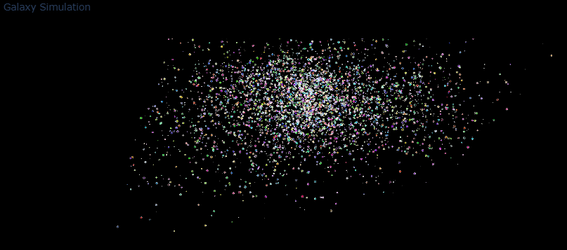

```python
import numpy as np
import matplotlib.pyplot as plt
from mpl_toolkits.mplot3d import Axes3D

# 銀河系の星を擬似生成
def generate_galaxy(num_stars=10000, disk_radius=15, disk_thickness=1.0):
    """
    銀河系の星を生成
    Parameters:
        num_stars (int): 星の数
        disk_radius (float): 銀河の半径
        disk_thickness (float): 銀河の厚さ
    Returns:
        x, y, z (numpy.ndarray): 各星の3次元座標
    """
    # 星の距離 (指数分布で中心に集中)
    r = np.random.exponential(scale=disk_radius / 3, size=num_stars)
    r = r[r < disk_radius]  # 銀河系の半径を超える星を除外
    theta = np.random.uniform(0, 2 * np.pi, len(r))
    z = np.random.normal(0, disk_thickness, len(r))
    x = r * np.cos(theta)
    y = r * np.sin(theta)

    return x, y, z

# 星を生成
num_stars = 10000
x, y, z = generate_galaxy(num_stars)

z_normalized = (z - np.min(z)) / (np.max(z) - np.min(z))

# 色マップ (グラデーション：　青 -> 白 -> 黄色 -> 赤)
colors = plt.cm.coolwarm(z_normalized)

# 3Dプロット
fig = plt.figure(figsize=(7, 7))
ax = fig.add_subplot(111, projection='3d')
scatter = ax.scatter(x, y, z, s=1, c=colors, alpha=0.7)

# 背景色：黒
ax.set_facecolor('black')
fig.patch.set_facecolor('black')

ax.set_xticks([])
ax.set_yticks([])
ax.set_zticks([])
ax.set_xlim([-15, 15])
ax.set_ylim([-15, 15])
ax.set_zlim([-3, 3])
ax.set_box_aspect([1, 1, 0.1])  # 銀河ディスクの形状を反映

ax.set_title("Milky Way Galaxy with Star Colors", color='white', fontsize=12)
plt.show()

```

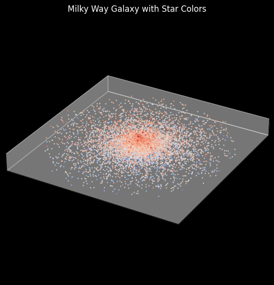


----
<div style="page-break-before: always;"></div>


### レトロゲーム：ブレイクアウト、ブロック崩し

- お題：　懐かしいブロック崩しゲームを作る
- 条件：　一行もコードを書かない
- 生成AIへのお願いメッセージ（プロンプト）を考えてみよう

```
Colaboratory環境、つまり、Webブラウザ環境で動作するブロック崩しゲームを作ってください。
Python言語をホストに、ゲスト言語はJavaScriptを生成して、ブラウザ上で対話的に操作できるようなゲームにしてください。
左右のキーでパドルを動かし、ボールを打ち返してください。衝突判定は甘めにしてください。
```

- 生成AIの回答例（時と場合によって変ります）

```python

from IPython.display import display, HTML

html_code = """
<!DOCTYPE html>
<html>
<head>
    <title>Breakout Game</title>
    <style>
        body { text-align: center; margin: 0; padding: 0; }
        canvas { background: black; display: block; margin: 0 auto; }
    </style>
</head>
<body>
    <canvas id='gameCanvas' width='800' height='600'></canvas>
    <script>
        const canvas = document.getElementById('gameCanvas');
        const ctx = canvas.getContext('2d');

        let paddle = { x: canvas.width / 2 - 35, y: canvas.height - 20, width: 70, height: 10 };
        let ball = { x: canvas.width / 2, y: canvas.height - 30, radius: 10, dx: 2, dy: -2 };
        let bricks = [];
        let brickRowCount = 5;
        let brickColumnCount = 8;
        let brickWidth = 75;
        let brickHeight = 20;
        let brickPadding = 10;
        let brickOffsetTop = 30;
        let brickOffsetLeft = 30;
        let keys = {};

        for (let c = 0; c < brickColumnCount; c++) {
            bricks[c] = [];
            for (let r = 0; r < brickRowCount; r++) {
                bricks[c][r] = { x: 0, y: 0, status: 1 };
            }
        }

        document.addEventListener('keydown', (e) => { keys[e.key] = true; });
        document.addEventListener('keyup', (e) => { keys[e.key] = false; });

        function drawPaddle() {
            ctx.fillStyle = 'white';
            ctx.fillRect(paddle.x, paddle.y, paddle.width, paddle.height);
        }

        function drawBall() {
            ctx.beginPath();
            ctx.arc(ball.x, ball.y, ball.radius, 0, Math.PI * 2);
            ctx.fillStyle = 'red';
            ctx.fill();
            ctx.closePath();
        }

        function drawBricks() {
            for (let c = 0; c < brickColumnCount; c++) {
                for (let r = 0; r < brickRowCount; r++) {
                    if (bricks[c][r].status == 1) {
                        let brickX = c * (brickWidth + brickPadding) + brickOffsetLeft;
                        let brickY = r * (brickHeight + brickPadding) + brickOffsetTop;
                        bricks[c][r].x = brickX;
                        bricks[c][r].y = brickY;
                        ctx.fillStyle = 'green';
                        ctx.fillRect(brickX, brickY, brickWidth, brickHeight);
                    }
                }
            }
        }

        function collisionDetection() {
            for (let c = 0; c < brickColumnCount; c++) {
                for (let r = 0; r < brickRowCount; r++) {
                    let b = bricks[c][r];
                    if (b.status == 1) {
                        if (ball.x > b.x && ball.x < b.x + brickWidth && ball.y > b.y && ball.y < b.y + brickHeight) {
                            ball.dy = -ball.dy;
                            b.status = 0;
                        }
                    }
                }
            }
        }

        function update() {
            if (keys['ArrowLeft'] && paddle.x > 0) paddle.x -= 7;
            if (keys['ArrowRight'] && paddle.x < canvas.width - paddle.width) paddle.x += 7;

            ball.x += ball.dx;
            ball.y += ball.dy;

            if (ball.x + ball.dx > canvas.width - ball.radius || ball.x + ball.dx < ball.radius) {
                ball.dx = -ball.dx;
            }
            if (ball.y + ball.dy < ball.radius) {
                ball.dy = -ball.dy;
            } else if (ball.y + ball.dy > canvas.height - ball.radius) {
                if (ball.x > paddle.x && ball.x < paddle.x + paddle.width) {
                    ball.dy = -ball.dy;
                } else {
                    document.location.reload();
                }
            }

            collisionDetection();

            ctx.clearRect(0, 0, canvas.width, canvas.height);
            drawPaddle();
            drawBall();
            drawBricks();
        }

        setInterval(update, 1000 / 60);
    </script>
</body>
</html>
"""

display(HTML(html_code))

```

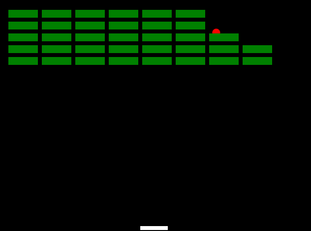

----
<div style="page-break-before: always;"></div>

### レトロゲーム：　シューティング


- お題：　かんたんなシューティングゲームを作る
- 条件：　一行もコードを書かない
- 生成AIへのお願いメッセージ（プロンプト）を考えてみよう

```
Colaboratory上で、Pythonから、HTMLを生成して、実行する方法を用いて、HTMLベースのレトロシューティングゲームを生成実行してください
```


```python
from IPython.display import display, HTML

html_code = """
<!DOCTYPE html>
<html>
<head>
    <title>Retro Shooting Game</title>
    <style>
        body { text-align: center; margin: 0; padding: 0; }
        canvas { background: black; display: block; margin: 0 auto; }
    </style>
</head>
<body>
    <canvas id="gameCanvas" width="800" height="600"></canvas>
    <script>
        const canvas = document.getElementById('gameCanvas');
        const ctx = canvas.getContext('2d');

        let player = { x: canvas.width / 2 - 15, y: canvas.height - 30, width: 30, height: 30 };
        let bullets = [];
        let enemies = [];
        let enemySpeed = 2;
        let bulletSpeed = 5;
        let keys = {};

        document.addEventListener('keydown', (e) => { keys[e.key] = true; });
        document.addEventListener('keyup', (e) => { keys[e.key] = false; });

        function drawPlayer() {
            ctx.fillStyle = 'white';
            ctx.fillRect(player.x, player.y, player.width, player.height);
        }

        function drawBullets() {
            ctx.fillStyle = 'red';
            bullets.forEach((bullet, index) => {
                bullet.y -= bulletSpeed;
                if (bullet.y < 0) {
                    bullets.splice(index, 1);
                } else {
                    ctx.fillRect(bullet.x, bullet.y, bullet.width, bullet.height);
                }
            });
        }

        function drawEnemies() {
            ctx.fillStyle = 'green';
            enemies.forEach((enemy, index) => {
                enemy.y += enemySpeed;
                if (enemy.y > canvas.height) {
                    enemies.splice(index, 1);
                } else {
                    ctx.fillRect(enemy.x, enemy.y, enemy.width, enemy.height);
                }
            });
        }

        function spawnEnemy() {
            let x = Math.random() * (canvas.width - 30);
            enemies.push({ x: x, y: 0, width: 30, height: 30 });
        }

        function detectCollisions() {
            bullets.forEach((bullet, bIndex) => {
                enemies.forEach((enemy, eIndex) => {
                    if (bullet.x < enemy.x + enemy.width &&
                        bullet.x + bullet.width > enemy.x &&
                        bullet.y < enemy.y + enemy.height &&
                        bullet.y + bullet.height > enemy.y) {
                        bullets.splice(bIndex, 1);
                        enemies.splice(eIndex, 1);
                    }
                });
            });
        }

        function update() {
            if (keys['ArrowLeft'] && player.x > 0) player.x -= 5;
            if (keys['ArrowRight'] && player.x < canvas.width - player.width) player.x += 5;
            if (keys[' '] && bullets.length < 3) bullets.push({ x: player.x + player.width / 2 - 2.5, y: player.y, width: 5, height: 10 });

            ctx.clearRect(0, 0, canvas.width, canvas.height);
            drawPlayer();
            drawBullets();
            drawEnemies();
            detectCollisions();
        }

        setInterval(update, 1000 / 60);
        setInterval(spawnEnemy, 1000);
    </script>
</body>
</html>
"""
display(HTML(html_code))
```

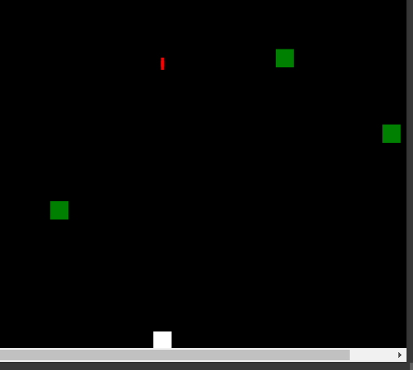

-----
<div style="page-break-before: always;"></div>

### 生成AIとの関係、立ち位置

- 30年前、プログラミングするAIは夢の夢だった
- プログラミングは文芸作品であり、
- ゲームは対話できるアートであった
- アートを生み出す創造力は人間らしさ、
- 人間に与えられた特権であった
- 
- だが、しかし・・・
- 
- ここ数年の生成AI,大規模言語モデルの技術の進歩はすさまじく
- 言葉を巧みにすばやく操るスキルは、人間のそれを超えてきた
- 普通の大学生のプログラミング能力は、生成AIに大きく水をあけられた
- 
- 生成AIにプロンプトで指示を出すだけの立ち位置から
- 大きな勘違いをしてはいけない
- 瞬時にロジックを組み立て回答する**生成AIが教師であって**、
- **プロンプトを考えて投げるだけなら、その瞬間はただの生徒に過ぎない**
- 生成AI謹製コードを、**しっかり消化吸収し**、
- それを**上回るロジックや技法を工夫する**ことで、ようやく対等の立場に並べる
-「もくもく」「自主トレ」「秘密特訓」「かべうち」に文句を言わずに
- 親切に付き合ってくれる生成AIは頼もしいパートナーである
- 正しい認識と正しい使い方を間違わずに、有効活用することが
- 自らを鍛え成長する

----

### 向いている? 向いていない? これからどうする？

- 賢すぎる人は、考えるだけで理解し、地道な作業に関心がない
- 小学校～高校まで、好き嫌いを克服できない人は、忍耐が続かない
- 勉強嫌い、宿題嫌い、仕事が嫌い、も同様
- プログラミングが、面白く楽しい時間だと感じること
- 解けない謎、攻略出来ない難問、上手くいかない時に、ワクワクできること
- 難問を攻略したときに、達成感と喜べること
- エラーや上手く動作しない時、謎解き・犯人捜しの名探偵に慣れる人は
- プログラムの世界に飛び込んで、思う存分、楽しんでほしい

### 何度失敗しても、再チャレンジできる世界

- 「形あるものはいつか壊れる」
  
- ハードウェア、モノづくりは壊したら、基本、取返しがつかない
- 
- その点、ソフトウェアは、材料費はかからず、
- 時間を巻き戻して、壊した操作を何度でもキャンセルできる：Undo/Redo
  
- 過ぎ去った時間は取り返せないが、失敗から学び、着実に成長が進む
- 何もしないより、手を動かすべし
- 試行錯誤の中から、奇跡の創造物を生み出すのが
- クリエイター・職人である
- 
- 人の心を揺さぶる創造作品は、
- 山のような試行錯誤と失敗の中から生まれてくる
 
- 失敗しても何度でもやり直せる環境・ツールを
- 常に自分の手元において、悩める時間も迷える時間も、
- ぼーっと過ごすより、ワクワクな冒険のお供としよう

----

##　ご清聴ありがとうございました